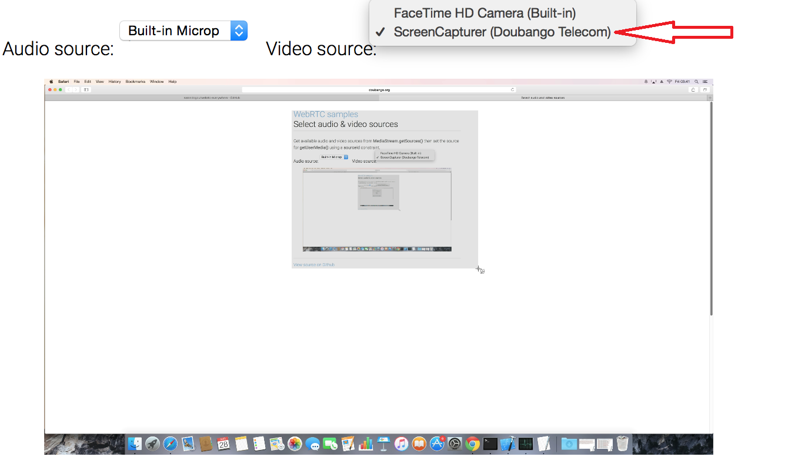

**webrtc-everywhere** is an open source project (with **business-friendly** <a href="#license">license</a>) to add support for WebRTC features to Safari (Windows and MAC OSX) and Internet Explorer (Windows).

# Downloads
 - <a href="https://doubango.org/webrtc/webrtc-everywhere-i386-10.4.dmg" target="_blank">MAC OSX</a> 
 - <a href="https://doubango.org/webrtc/setup.exe" target="_blank">Windows</a>

# Online samples 
The following samples use our <a href="https://github.com/sarandogou/webrtc/blob/master/samples/web/js/adapter.js" target="_blank">adapter.js</a> and could be tested on Safari and Internet Explorer (off course they also work on Firefox and Chrome): 
 - <a href="https://doubango.org/webrtc/samples/web/content/getusermedia" target="_blank">getUserMedia()</a>
 - <a href="https://doubango.org/webrtc/samples/web/content/getusermedia-resolution" target="_blank">Choose camera resolution</a>
 - <a href="https://doubango.org/webrtc/samples/web/content/getusermedia-source" target="_blank">Choose camera and microphone </a> (on version 2.0.0 it's also used to test screenshare)
 - <a href="https://doubango.org/webrtc/samples/web/content/getusermedia-audio" target="_blank">Audio-only getUserMedia() output to local audio element</a>
 - <a href="https://doubango.org/webrtc/samples/web/content/getusermedia-canvas" target="_blank">getUserMedia() + Canvas</a> (<font color="red">slowness issue fixed in 1.1.0</font>)
 - <a href="https://doubango.org/webrtc/samples/web/content/getusermedia-filter" target="_blank">getUserMedia() + Canvas + CSS filters</a> (<font color="red">slowness issue fixed in 1.1.0</font>)
 - <a href="https://doubango.org/webrtc/samples/web/content/face" target="_blank">getUserMedia() + Face tracking</a> (<font color="red">requires version 1.2.0</font>)
 - <a href="https://doubango.org/webrtc/samples/web/content/datachannel" target="_blank">Data channels</a> (<font color="red">requires version 1.2.0</font>)
 - <a href="https://doubango.org/webrtc/samples/web/content/peerconnection" target="_blank">Peer connection</a>
 - <a href="https://doubango.org/webrtc/samples/web/content/peerconnection-audio" target="_blank">Audio-only peer connection</a>
 - <a href="https://doubango.org/webrtc/samples/web/content/multiple" target="_blank">Multiple peer connections</a>
 - <a href="https://doubango.org/webrtc/samples/web/content/multiple-relay" target="_blank">Multiple relay</a>
 - <a href="https://doubango.org/webrtc/samples/web/content/munge-sdp" target="_blank">Munge SDP</a>
 - <a href="https://doubango.org/webrtc/samples/web/content/pr-answer" target="_blank">Accept incoming peer connection</a>
 - <a href="https://doubango.org/webrtc/samples/web/content/peerconnection-states" target="_blank">Peer connection states</a>
 - <a href="https://doubango.org/webrtc/samples/web/content/constraints" target="_blank">Constraints and stats</a>
 - <a href="https://doubango.org/webrtc/samples/web/content/create-offer" target="_blank">Display createOffer output</a>
 - <a href="https://doubango.org/webrtc/samples/web/content/trickle-ice" target="_blank">ICE candidate gathering</a>
 - <a href="https://doubango.org/webrtc/samples/web/content/trickle-ice" target="_blank">DTMF</a> (<font color="red">requires version 1.2.0</font>)
 


# Using our plugin in your own project
 - Download and install the plugin for <a href="https://doubango.org/webrtc/webrtc-everywhere-i386-10.4.dmg" target="_blank">MAC OSX</a> or <a href="https://doubango.org/webrtc/setup.exe" target="_blank">Windows</a>
 - Include <a href="https://github.com/sarandogou/webrtc/blob/master/samples/web/js/adapter.js" target="_blank">adapter.js</a> in your code.
 - Change the code you're using to attach a stream to a &lt;audio/&gt; or &lt;video /&gt; HTML5 element: <br />
 from:
 ```
 document.getElementById("eltId").src = mediaStream;
  ```
 <br /> to:
  ```
 attachMediaStream(document.getElementById("eltId"), mediaStream);
  ```

# Screenshare
Support for screenshare was added in version 2.0. To choose your screen as video media source (instead of the camera) you need to use ***"X978DoubangoTelecomScreenCapturer785"*** as **sourceId**.




Sample code to select your screen as media source: 
 ```
 navigator.getUserMedia({ "video": {optional: [{sourceId: "X978DoubangoTelecomScreenCapturer785"}]}}, okfn, errfn);
 ```

# Building source code
 - fetch webrtc code as explained at [http://www.webrtc.org/native-code/development](http://www.webrtc.org/native-code/development) in the **same folder** as webrtc-everywhere.
 - Move into **webrtc-checkout/src** directory <br />
 ```
 cd webrtc-checkout/src
 ```
 - For Windows you'll need to apply [this patch](/webrtc_win.patch)

 - **OSX x86_64**<br />
 ```
 python webrtc/build/gyp_webrtc -Dtarget_arch=x64 -DOS=mac
 ninja -C out/Debug
 ninja -C out/Release

 mv out/Debug out/Debug_x64
 mv out/Release out/Release_x64
 ```
 
 - **OSX i386**<br />
 ```
 python webrtc/build/gyp_webrtc -Dtarget_arch=ia32 -DOS=mac
 ninja -C out/Debug
 ninja -C out/Release

 mv out/Debug out/Debug_i386
 mv out/Release out/Release_i386
 ```
 
 - **WIN64**<br />
 ```
 python webrtc/build/gyp_webrtc -Dtarget_arch=x64 -DOS=win
 ninja -C out/Debug_x64
 ninja -C out/Release_x64
 ```
 
 - **WIN32**<br />
 ```
 python webrtc/build/gyp_webrtc -Dtarget_arch=ia32 -DOS=win
 ninja -C out/Debug
 ninja -C out/Release
 ```
 
<br />
<br />
To build the source code you'll need Visual Studio 2013+ (Windows) or Xcode (MAC OSX):
  - Visual Studio solution: **webrtc-everywhere/webrtc-everywhere.sln**
  - Xcode project: **webrtc-everywhere/xcode/webrtc-everywhere.xcodeproj**

# License
 - Binaries and installers: All binaries and installers **from us** are released under **BSD** terms to allow using the project in your commercial products.
 - The source code: **GPLv3**. Please contact us for alternative license options.

# Known issues
 - On Safari/OSX, if you're getting *TypeError: undefined is not a function (evaluating 'getPlugin()...*:
 	- Change the security settings to manually enable the plugin: [http://support.apple.com/en-us/HT202819](http://support.apple.com/en-us/HT202819)

# Getting help
The best way to get help is via our <a href="https://groups.google.com/forum/#!forum/webrtc-everywhere" target="_blank">dev-group</a>.

# Release notes
 - **1.3.1**
  - Fix issue [Issue #24](../../issues/24), [Issue #23](../../issues/23), [Issue #22](../../issues/22), [Issue #21](../../issues/21), [Issue #19](../../issues/19), [Issue #15](../../issues/15), [Issue #13](../../issues/13) and [Issue #2](../../issues/2)

# Release notes
 - **1.2.2**
  - Fix [Issue #17](../../issues/17) and [Issue #18](../../issues/18)
  
# Release notes
 - **1.2.1**
  - Fix [Issue #15](../../issues/15)
  - Adds support for x64 (Windows)
  - Change Windows setup:
   * to register the ActiveX under HKCU instead of HKLM
   * to install binaries under AppData folder instead of ProgramFiles
   * to bundle 32bit and 64bit binaries

**It's highly recommended to uninstall any old version before installing this one**

 - **1.2.0**
 	- Adds <a href="http://www.w3.org/TR/webrtc/#idl-def-RTCDataChannel" target="_blank">DataChannel</a> API with support for **Strings**, **BLOBs** and **ArrayBuffers** (Int8Array, Uint8Array, Uint8ClampedArray, Int16Array, Uint16Array, Int32Array, Uint32Array, Float32Array and Float64Array).
 	- Adds support for <a href="http://www.w3.org/TR/webrtc/#rtcdtmfsender" target="_blank">DTMFSender</a> API.
 	- Implements secure prompt in getUserMedia. Websites served over **htpps** are stored in local file encrypted using **DES-CBC**. The encryption keys are defined at build time.
   - Bug fix: [Issue #3](../../issues/3), [Issue #10](../../issues/10) and [Issue #11](../../issues/11)

 - **1.1.0**
	- Add new JavaScript function: <b>Webrtc::getScreenShot()</b>. This function converts the RGB32 raw image to bitmap then to base64. The process is instantaneous and the base64 image could be used in JavaScript like this:
  ```
	var image = new Image();
	image.onload = function () {
		document.getElementById("mycanvas").getContext("2d").drawImage(image, 0, 0, width, height);
	};
	image.src = "data:image/png;base64," + base64;
  ```
   - Bug fix:
    	- [Issue #6](../../issues/6): The active element tag flashes when the window is resized or scrolled
    	- [Issue #7](../../issues/7): drawImage() function is toooo slooow
    	- [Issue #8](../../issues/8): Color alignment issue in drawImage()
 - **1.0.1**
	- Initial release **without** support for DataChannel
